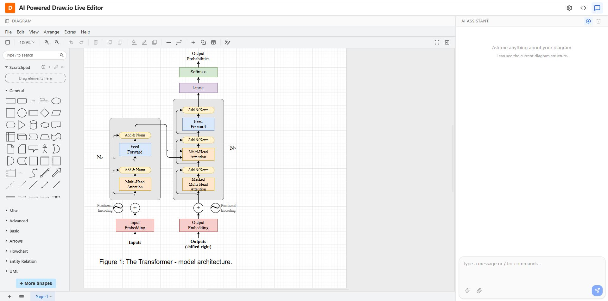

# Draw.io Live Editor

An AI-powered online diagram editor based on Draw.io, designed specifically for technical documentation.

## Introduction

Draw.io Live Editor is a locally deployable diagram editing tool designed to help developers and technical writers quickly and conveniently create various types of diagrams.

### Design Philosophy

When writing technical documentation, we often need to create architecture diagrams, flowcharts, sequence diagrams, and other types of diagrams. However, due to data security requirements, many enterprises and teams cannot directly use online services from the public internet. To address this pain point, we developed Draw.io Live Editor.

### Core Features

- **Fully Local Deployment**: All components (Draw.io, LLM service) are hosted locally to ensure data security
- **Docker Containerization**: All services are provided as Docker images for simple deployment and consistent environments
- **Bidirectional Interoperability**: Draw.io visual operations are directly reflected in the code representation visible to the LLM, enabling true human-AI collaboration rather than one-way dependency. Users can edit either the visual diagram or the XML code, and changes sync in real-time
- **AI-Assisted Creation**: Integrated LLM service allows diagram generation through natural language descriptions
- **Real-time Preview**: Monaco Editor and Draw.io canvas sync in real-time, WYSIWYG
- **Flexible Configuration**: Support for custom LLM service, Draw.io configuration, and user preferences
- **Seamless Component Integration**: All components (editor, diagram engine, AI chat, gateway) are fully integrated and communicate seamlessly, laying a solid foundation for future extensions and enhancements

### Tribute

The system displays a default Transformer architecture diagram on startup as a tribute to the groundbreaking paper "Attention is All You Need". We also want to express our respect to Draw.io - without this excellent open-source project, this tool would not exist.

## Screenshot



*The main interface showing the integrated Monaco Editor, Draw.io canvas, and AI chat panel.*


## Quick Start

### Environment Configuration

Before running the application, you need to configure the LLM service:

1. Copy the environment template:
   ```bash
   cp .env.example .env
   ```

2. Edit the `.env` file and fill in your LLM service configuration:
   ```bash
   TARGET_BASE_URL=https://your-llm-service.com/v1
   TARGET_API_KEY=your-actual-api-key
   TARGET_MODEL=your-model-name
   ```

3. **Important**: Never commit the `.env` file to version control. It contains sensitive credentials.

### Development Mode

```bash
pnpm install
pnpm run dev
```

The development server will start at `http://localhost:3000`.

### Docker Deployment

```bash
# Development mode
docker-compose --profile dev up

# Production mode
docker-compose --profile prod up
```

After deployment, access the application at:

```
http://{host}:8899
```

Where `8899` is the default port for the gateway service, and you can change it in `docker-compose.yml`.

### Configuration Adjustment

You can adjust the following configurations based on your needs:

#### 1. LLM Service Configuration (.env file)

Main parameters include:
- `TARGET_BASE_URL`: LLM API endpoint address
- `TARGET_API_KEY`: API key
- `TARGET_MODEL`: Model name to use

#### 2. Port Configuration (docker-compose.yml)

You can modify port mappings for each service as needed:
- `8890`: Draw.io service port
- `8891`: LLM service port
- `8892`: Editor service port
- `8899`: Gateway port (main entry point)

#### 3. User Preferences

After the application starts, you can configure in the settings interface:
- **LLM Configuration**: API endpoint, key, model, temperature, max tokens, system prompt, etc.
- **Draw.io Configuration**: Base URL, default to /drawio/, and you can use https://embed.diagrams.net too if you want to use the public service.
- **Editor Preferences**:
  - Auto-apply diagram code returned by LLM
- **Chat Preferences**:
  - Auto-scroll in chat window

## Technical Architecture

### Technology Stack

- **Frontend Framework**: Svelte + TypeScript + Vite
- **Editor**: Monaco Editor
- **Diagram Engine**: Draw.io (jgraph/drawio)
- **Containerization**: Docker + Docker Compose
- **Gateway Service**: OpenResty (Nginx + Lua)
- **LLM Integration**: OpenAI-compatible API support, and it is easy to add other LLM services.

### Architecture Design


*The architecture diagram showing the Draw.io Live Editor architecture.*

### Service Description

- **Gateway**: Unified entry point, routing distribution, reverse proxy
- **Draw.io**: Diagram rendering engine, provides visual editing capabilities
- **Editor**: Main application service, includes Monaco Editor and AI chat interface
- **LLM**: Local LLM proxy service, forwards requests to configured LLM backend

### Extensibility

The current architecture lays a solid foundation for future expansion:
- Microservice architecture, components deployed independently
- Docker-based containerization, easy to scale horizontally
- OpenResty gateway supports flexible routing and load balancing
- Support for multiple LLM backends (OpenAI, DeepSeek, local models, etc.)

## Features

### Diagram Editing

- Real-time bidirectional sync: Monaco Editor ↔ Draw.io canvas
- Direct editing of Draw.io XML format
- Code highlighting and auto-completion
- Undo/redo functionality

### AI Assistance

- Generate diagrams from natural language descriptions
- Intelligently optimize existing diagrams
- Code explanation and documentation generation
- Context awareness (can view current diagram)

### About LLM Output Quality

Current open-source LLM services are general-purpose models not specifically fine-tuned for diagram generation. As a result, the quality and consistency of generated diagrams may vary depending on:
- User input clarity and specificity
- Model capabilities and training data
- Complexity of the requested diagram

**Improvement Strategies:**

If you want to achieve better diagram generation results, consider the following approaches:

1. **Fine-tuning**: Train or fine-tune models specifically for diagram generation tasks to improve output quality and consistency
2. **Prompt Engineering**: Optimize prompts with clear instructions, examples, and structured formats to guide the model more effectively
3. **Iterative Refinement**: Start with simple diagrams and iteratively refine them through conversation with the AI

These are all viable directions worth exploring. If you have specific requirements or would like to discuss optimization strategies for your use case, we welcome the conversation!

## Development Status

⚠️ **Project in Early Development Stage**

The system is still under active development and may have the following issues:
- Features not yet complete
- Potential bugs

### Feedback and Contribution

We warmly welcome technical exchanges and usage feedback! Whether you have questions, suggestions, or just want to share your experience, please don't hesitate to reach out:

- **Submit an Issue**: Report bugs or request features on GitHub
- **Create a Pull Request**: Contribute code improvements or new features
- **Technical Discussion**: Share your ideas and best practices
- **Contact Directly**: Reach out to the project maintainer for direct communication

Your feedback and contributions are invaluable for improving this project. We look forward to hearing from you!

## Acknowledgments

Thanks to the following open-source projects:
- [Draw.io](https://github.com/jgraph/drawio) - Powerful diagram editing engine
- [Monaco Editor](https://microsoft.github.io/monaco-editor/) - The editor core of VS Code
- [Svelte](https://svelte.dev/) - Elegant frontend framework
- [OpenResty](https://openresty.org/) - High-performance web platform